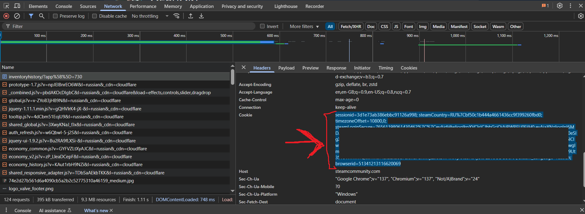
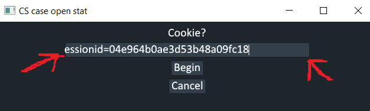
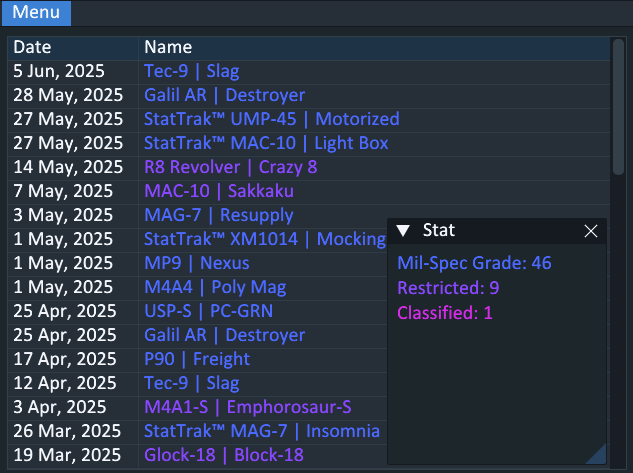

# CS case open stat

Inspired by [this](https://github.com/cantryDev/CSGOCaseStatsViewerV2)\
But i dont like install java and use command line so i made this

# How to use 

1) Open your [inventoryhistory](https://steamcommunity.com/my/inventoryhistory) 
2) Press `F12` and open `Network` tab
3) Get your `Cooke`

4) Paste it into the app \

5) Click `Begin` and wait

#### Result

